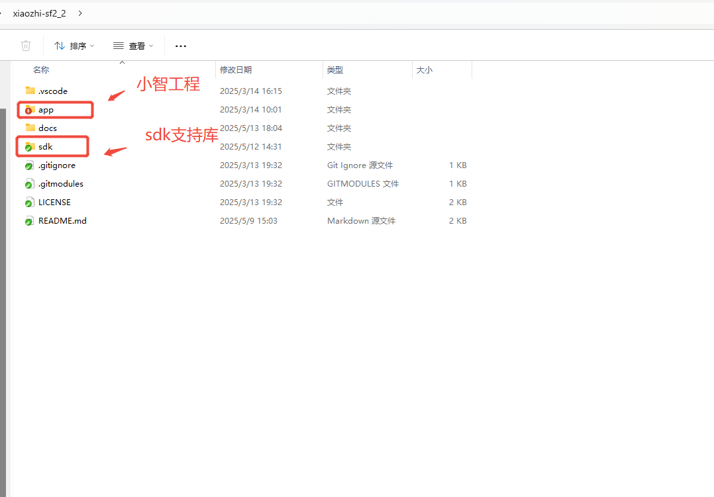

## 准备工作

### 安装工具链

在开始前，我们需要确保安装了 `SiFli-ENV` 工具。目前最新版的下载链接为：<https://downloads.sifli.com/sdk/env_1.1.1.zip>

### 克隆源码

该步骤的前置准备是你安装了 git 工具，如何安装不多赘述。

目前源码仅托管在 GitHub 上，仓库链接为：<https://github.com/78/xiaozhi-sf32>

使用以下命令克隆源码：

```bash
git clone --recursive https://github.com/78/xiaozhi-sf32.git
```

::: tip

需要注意的是，`--recursive` 参数是必须的，因为我们使用了子模块来管理依赖库。如果你忘记添加这个参数clone的话，请使用下面的命令重新拉取子模块(submodule)：

```bash
git submodule update --init --recursive
```

:::

拉取之后的目录如图所示：



## 编译工程

按照上一步中的步骤，进入解压好的 `SiFli-ENV` 工具目录下，双击 `env.bat` 文件，打开命令行窗口。


根据提示，我们需要在sdk的根目录下输入设置环境命令


### 设置环境及编译命令

假设我们的工程被克隆到了 `C:\xiaozhi-sf32` 目录下，SDK的路径为 `C:\xiaozhi-sf32\sdk`

⚠ 注意：示例中board 参数为 `sf32lb52-nano_52j`，sf32lb52-nano编译过程目标板子名称需要根据芯片丝印实际情况修改。
```bash
cd C:\xiaozhi-sf32\sdk
set_env.bat gcc
cd C:\xiaozhi-sf32\app\project
scons --board=sf32lb52-nano_52j -j8
```


::: tip
在 `scons` 命令中，`--board` 参数指定了编译的目标板子，`-j8` 参数指定了编译的线程数，可以根据自己的电脑性能进行调整。
:::

编译成功显示如下图：


编译生成的文件存放在`build_<board_name>`目录下，包含了需要下载的二进制文件和下载脚本，其中`<board_name>`为以内核为后缀的板子名称，例如`sf32lb52-nano_52j_build`

## 下载程序

保持开发板与电脑的USB连接，运行`build_sf32lb52-nano_52j_hcpu\uart_download.bat`下载程序到开发板，当提示`please input serial port number`，输入开发板实际，例如COM19就输入19，输入完成后敲回车即开始下载程序，完成后按提示按任意键回到命令行提示符。

::: tip

sf32lb52-nano_52j_hcpu\uart_download.bat 
Linux和macOS用户建议直接使用`sftool`工具下载，使用方法可参考[sftool](https://wiki.sifli.com/tools/SFTool.html)。需要下载的文件有`bootloader/bootloader.elf`、`ftab/ftab.elf`、`main.elf`这三项

:::
